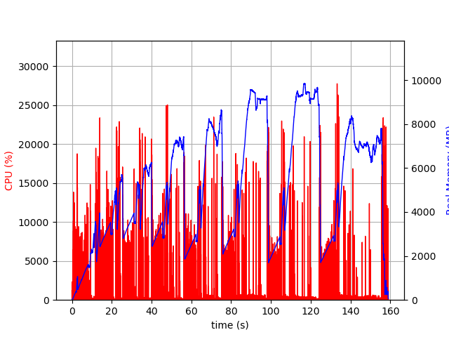

# HW1

Shaoze Yang 520370910085

## EX.1

1. Control groups, commonly referred to as cgroups, are a Linux kernel feature that allows the allocation and management of system resources to groups of processes. Cgroups enable fine-grained control over system resources such as CPU, memory, disk I/O, and network bandwidth. By organizing processes into distinct cgroups, administrators can set resource limits, prioritize resources, and enforce resource usage policies.

   Cgroups provide a mechanism for resource isolation, ensuring that one group of processes does not monopolize system resources at the expense of others. This capability is particularly useful in multi-tenant environments, virtualization, and containerization technologies like Docker and Kubernetes.

   Using cgroups, administrators can set limits on CPU usage, define memory quotas, and restrict disk I/O bandwidth for specific groups of processes. These limits and restrictions help prevent resource contention and ensure fair resource allocation among different applications or users.

   Cgroups also offer the ability to monitor resource usage, collect statistics, and enforce resource policies dynamically. This dynamic management allows system administrators to react to changing resource demands and adjust allocations accordingly, optimizing system performance and stability.

   In summary, cgroups are a powerful Linux kernel feature that provides resource management, isolation, and control capabilities. They play a crucial role in ensuring efficient resource utilization, enforcing fair sharing of resources, and maintaining system stability in diverse computing environments.

2. Cgroups and processes are both fundamental concepts in Linux, but they serve different purposes and operate at different levels of abstraction. Here are the differences and similarities between cgroups and processes:

   1. Definition:
      - Process: A process is an instance of a running program that has its own memory space, execution context, and resources.
      - Cgroup: A cgroup is a Linux kernel feature that allows grouping and management of processes, controlling their resource allocation and usage.
   2. Scope:
      - Process: Processes are individual entities running on the operating system, identified by their unique process IDs (PIDs). Each process operates within its own context and has its own set of resources.
      - Cgroup: Cgroups operate at a higher level than individual processes. They group multiple processes together and manage their collective resource allocation and usage. Cgroups allow managing resources for a set of processes as a single unit.
   3. Resource Control:
      - Process: Processes can request and consume system resources such as CPU, memory, and disk I/O individually. They do not have built-in mechanisms to limit or control the resources they use.
      - Cgroup: Cgroups enable fine-grained resource control. They provide mechanisms to set limits and allocate resources among groups of processes. Resource control can be applied to CPU usage, memory allocation, disk I/O bandwidth, network traffic, and more.
   4. Resource Monitoring:
      - Process: Processes can gather information about their own resource usage, such as CPU utilization or memory consumption, through system calls or utilities.
      - Cgroup: Cgroups provide resource monitoring and statistics collection at the group level. Administrators can monitor resource usage for a cgroup and its associated processes collectively, including CPU usage, memory usage, I/O statistics, and more.
   5. Hierarchy and Inheritance:
      - Process: Processes are organized in a hierarchical structure, where child processes are created from parent processes. Child processes inherit the resources and settings of their parent processes.
      - Cgroup: Cgroups also have a hierarchical structure, forming a tree-like organization. Child cgroups inherit the resource limits and settings from their parent cgroups, allowing for hierarchical resource management and inheritance.
   6. Management Flexibility:
      - Process: Processes are managed individually. Each process can be started, stopped, and controlled independently.
      - Cgroup: Cgroups provide a mechanism for managing groups of processes collectively. Resource control, monitoring, and policy enforcement can be applied to a set of processes as a whole, providing more flexibility and control over resource allocation.

   In summary, processes are individual entities running on the operating system, while cgroups provide a higher-level mechanism to group and manage processes collectively. Cgroups offer resource control, monitoring, and policy enforcement at the group level, enabling administrators to allocate and manage resources efficiently and effectively.

3. Kernel namespaces, a feature in Linux, contribute to the security of the operating system by providing process isolation and resource separation. Here are some ways in which kernel namespaces enhance OS security:

   1. Process Isolation: Kernel namespaces create separate and isolated environments for different processes, preventing them from interfering with or accessing each other's resources. Each namespace has its own set of process IDs (PIDs), network interfaces, mount points, and other system resources. This isolation prevents processes from accessing sensitive information or modifying critical system components.

   2. Network Isolation: The network namespace feature allows the creation of isolated network environments for processes. Each network namespace has its own network stack, IP addresses, routing tables, and network devices. This isolation prevents processes in different namespaces from directly communicating or interfering with each other over the network, enhancing network security and minimizing the risk of unauthorized access or data leakage.

   3. Filesystem Isolation: By using mount namespaces, different processes or namespaces can have their own separate views of the file system. This isolation ensures that processes within one namespace cannot access or modify files or directories belonging to other namespaces, thereby enhancing file system security and preventing unauthorized access or tampering.

   4. Resource Limitation: Namespaces allow administrators to set resource limits and quotas on a per-namespace basis. This capability enables fine-grained control over resource utilization, preventing a single process or namespace from consuming excessive system resources and potentially causing denial-of-service situations or impacting the stability of the overall system.

   5. Privilege Separation: Kernel namespaces are often used in combination with other security mechanisms like containers (e.g., Docker) to provide privilege separation. By isolating processes and their associated resources, namespaces allow running applications with reduced privileges, minimizing the potential impact of security vulnerabilities or exploits.

   6. Enhanced Security Policies: Kernel namespaces serve as a foundation for implementing enhanced security policies. For example, namespaces can be combined with other security frameworks like SELinux (Security-Enhanced Linux) or AppArmor to enforce additional access controls and restrictions on processes within each namespace, further enhancing security.

   Overall, kernel namespaces play a vital role in improving OS security by isolating processes, providing separate network and filesystem environments, enabling resource limitation, and facilitating privilege separation. These capabilities help mitigate the risk of unauthorized access, data breaches, and resource abuse, making the operating system more robust and secure.

## EX.2



```python
>>> import pandas as pd
>>> df1 = pd.read_csv("./flight_data/1987.csv")
>>> df = pd.concat([df1, pd.read_csv("./flight_data/1988.csv")])
>>> df = pd.concat([df, pd.read_csv("./flight_data/1989.csv")])
>>> df = pd.concat([df, pd.read_csv("./flight_data/1990.csv")])
>>> df = pd.concat([df, pd.read_csv("./flight_data/1991.csv")])
>>> df = pd.concat([df, pd.read_csv("./flight_data/1992.csv")])
>>> df = pd.concat([df, pd.read_csv("./flight_data/1993.csv")])
>>> df = pd.concat([df, pd.read_csv("./flight_data/1994.csv")])
>>> df = pd.concat([df, pd.read_csv("./flight_data/1995.csv")])
```


using `htop` in command line to monitor the mem occupation of python shell

### 1. 

a) Intel Core i9

b) RAM 16G

c) htop command


 ### 2.

a) MQ

b) ORD ATL DFW

c) 

|AA    |    1525.0|
| :--: | :--: |
|AS    |    1139.0|
|CO    |    1178.0|
|DL    |    1189.0|
|EA    |    1179.0|
|HP    |    1323.0|
|NW    |    2598.0|
|PA    |    1438.0|
|PI    |    1381.0|
|PS    |    1033.0|
|TW    |     931.0|
|UA    |    1612.0|
|US    |    1073.0|
|WN    |     889.0|
|ML    |     584.0|
|AQ    |     623.0|
|B6    |    1392.0|
|DH    |    1438.0|
|EV    |    1187.0|
|FL    |    1175.0|
|HA    |    1309.0|
|MQ    |    1707.0|
|OO    |    1435.0|
|TZ    |    1300.0|
|XE    |     939.0|
|OH    |    1380.0|
|F9    |     920.0|
|YV    |     715.0|
|9E    |    1942.0|

### 3.

- One hot encoder the column "UniqueCarrier" "DayOfWeek"

- Normalize feature columns
- OLS linear regression

Conclusion: almost no relationship

​                                     


```python
import pandas as pd
from sklearn.preprocessing import OneHotEncoder
from sklearn.preprocessing import StandardScaler
import numpy as np
import statsmodels.api as sm

import warnings
warnings.filterwarnings("ignore")

df = pd.read_csv("./flight_data/2007.csv")
df = df[["DayOfWeek", "DepTime", "CRSDepTime", "ArrTime", "CRSArrTime", "UniqueCarrier", "DepDelay"]]
df = df.dropna(how='any',axis =0)

# OHE
encoder = OneHotEncoder(sparse_output=False)
encoder.fit(df[["DayOfWeek"]])
encoded_data = encoder.transform(df[["DayOfWeek"]])
encoded_df = pd.DataFrame(encoded_data, columns=encoder.get_feature_names_out())
transformed_df = pd.concat([df[["DepTime", "CRSDepTime", "ArrTime", "CRSArrTime", "UniqueCarrier", "DepDelay"]], encoded_df], axis=1)
transformed_df["Ln_DepDelay"] = np.log(df["DepDelay"])


encoder = OneHotEncoder(sparse_output=False)
encoder.fit(df[['UniqueCarrier']])
encoded_data = encoder.transform(df[['UniqueCarrier']])
encoded_df = pd.DataFrame(encoded_data, columns=encoder.get_feature_names_out())
transformed_df = pd.concat([transformed_df, encoded_df], axis=1)

# Normalize
features = ['DepTime', 'CRSDepTime', 'ArrTime', 'CRSArrTime',
            'DayOfWeek_1', 'DayOfWeek_2', 'DayOfWeek_3', 'DayOfWeek_4',
            'DayOfWeek_5', 'DayOfWeek_6', 'DayOfWeek_7',
            'UniqueCarrier_9E', 'UniqueCarrier_AA', 'UniqueCarrier_AQ',
            'UniqueCarrier_AS', 'UniqueCarrier_B6', 'UniqueCarrier_CO',
            'UniqueCarrier_DL', 'UniqueCarrier_EV', 'UniqueCarrier_F9',
            'UniqueCarrier_FL', 'UniqueCarrier_HA', 'UniqueCarrier_MQ',
            'UniqueCarrier_NW', 'UniqueCarrier_OH', 'UniqueCarrier_OO',
            'UniqueCarrier_UA', 'UniqueCarrier_US', 'UniqueCarrier_WN',
            'UniqueCarrier_XE', 'UniqueCarrier_YV']

data_features = transformed_df[features]
scaler = StandardScaler()
normalized_features = scaler.fit_transform(data_features)
normalized_data = pd.DataFrame(normalized_features, columns=features)
normalized_data = pd.concat([normalized_data, transformed_df.drop(features, axis=1)], axis=1)

# OLS
normalized_data = normalized_data.dropna(how='any')
# normalized_data = normalized_data[normalized_data["Ln_DepDelay"] > 1][normalized_data["Ln_DepDelay"] < 4]
test_df = normalized_data
X = test_df[features]
y = test_df[["Ln_DepDelay"]]

model = sm.OLS(y.to_numpy(), X.to_numpy())
results = model.fit()
print(results.summary())
```

​                                               

## Ex.3

### 1.

```java
package org.example;
import java.io.BufferedReader;
import java.io.FileReader;
import java.io.IOException;
import java.util.ArrayList;
import java.util.Collections;
import java.util.List;
import java.io.BufferedWriter;
import java.io.FileWriter;

public class Main {
    public static void main(String[] args) {
        String filePath = "./test.txt";
        List<String> lines = new ArrayList<String>();
        // Read from file
        try (BufferedReader reader = new BufferedReader(new FileReader(filePath))) {
            String line;
            while ((line = reader.readLine()) != null) {
                lines.add(line);
            }
        } catch (IOException e) {
            e.printStackTrace();
        }
        // Shuffle
        Collections.shuffle(lines);

        // Write to file
        String Shuffled_file_path = "./shuffled.txt";
        try (BufferedWriter writer = new BufferedWriter(new FileWriter(Shuffled_file_path))) {
            for (String line : lines) {
                writer.write(line);
                writer.newLine();
            }
        } catch (IOException e) {
            e.printStackTrace();
        }
    }
}
```


### 2.

```java
package org.example;
import java.util.*;

class Vehicles{
    // define basic attributes
    String type;
    String brand;

    public Vehicles(){
        this.type= "Default_type";
        this.brand = "Default_brand";
    }
    public Vehicles(String type, String brand, int age){
        this.type = type;
        this.brand = brand;
    }
    public void getInfo() {
        System.out.println("I don't know the info");
    }
}

class Car extends Vehicles{
    Integer age;
    public Car(){
        type = "Car";
        brand = "Tesla";
        age = 1;
    }
    @Override
    public void getInfo() {
        System.out.println("This is a Car, my father is vehicle");
        System.out.println("type:" + type + "\nBrand:" + brand + "\nAge: " + age);
    }
}

class Bus extends Vehicles{
    public Bus(){
        type = "Bus";
        brand = "Benz";
    }
    @Override
    public void getInfo() {
        System.out.println("This is a Bus, my farther is vehicle");
        System.out.println("type:" + type + "\nBrand:" + brand );
    }
}

public class Main {
    public static void main(String[] args) {
        Vehicles my_vehicle = new Vehicles();
        Vehicles my_bus = new Bus();
        Vehicles my_car = new Car();
        my_vehicle.getInfo();
        my_car.getInfo();
        my_bus.getInfo();
    }
}

```

Output:

```
I don't know the info
This is a Car, my father is vehicle
type:Car
Brand:Tesla
Age1
This is a Bus, my farther is vehicle
type:Bus
Brand:Benz
```

