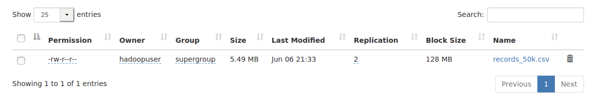

# Homework2

Shaoze Yang

## EX1

```python
#!/usr/bin/env python3
FirstnameTime = 5000
LastnameTime = 80000
totalNames = 50000000
fileNum = 10000

from random import randint
from loguru import logger
from tqdm import tqdm

def readNames(fname:str, linenum:int):
	names = []
	with open(fname, 'r') as file:
		for i in range(linenum):
			line = file.readline()
			if not line:
				break
			names.append(line.strip())
	return names

def genID():
	id = ""
	for i in range(10):
		id = id + str(randint(0,9))
	return id

def genCsv(fname):
	firstnames = readNames("firstnames.txt",FirstnameTime)
	lastnames = readNames("lastnames.txt",LastnameTime)
	with open(fname, 'w') as file:
		for i in tqdm(range(int(totalNames / fileNum)):
			name = firstnames[randint(0,FirstnameTime-1)] + " " + lastnames[randint(0,LastnameTime-1)]
			id = genID()
			scoreNum = randint(3,5)
			for j in range(scoreNum):
				score = str(randint(0,100))
				file.write(name+","+id+","+score+"\n")

try:
  for i in tqdm(range(fileNum)):
    genCsv("./records_{}.csv".format(i))
except Exception as error:
   	logger.exception(error)

```

128MB



## EX3

 A [regular expression](http://en.wikipedia.org/wiki/Regular_expression) that causes S3DistCp to concatenate files that match the expression. For example, we could use this option to combine all of the log files written in one hour into a single file. The concatenated filename is the value matched by the regular expression for the grouping. In our example, we could use this option to combine all of the small `csv` files into a single large file.

```shell
‑‑groupBy=PATTERN
# Example
‑‑groupBy=.*subnetid.*([0-9]+-[0-9]+-[0-9]+-[0-9]+).*
s3-dist-cp --src hdfs:///input --dest hdfs:///output --groupBy='*.csv'
```


## EX4

1. b)

   The Snappy codec, also known as Google Snappy, is a fast and efficient compression/decompression library. It aims to provide high-speed compression and decompression with low CPU usage, making it suitable for scenarios where speed is a priority.

   Snappy is designed for use cases that require rapid compression and decompression of data, especially when the data needs to be processed in real-time or near real-time. It achieves its speed by using a combination of a simple compression algorithm and optimized implementation techniques.

   Here are some scenarios where Snappy is commonly used:

   1. Big Data processing: Snappy is often employed in big data frameworks like Apache Hadoop, Apache Spark, and Google's Bigtable, where large amounts of data need to be processed quickly.

   2. Distributed systems: Snappy can be used in distributed systems, such as distributed file systems, to compress data before transmission across the network, reducing network bandwidth requirements and improving overall performance.

   3. In-memory caching: Snappy is suitable for compressing data stored in memory caches, where quick retrieval is crucial. It enables efficient memory utilization and reduces the amount of data that needs to be transferred between different components of a system.

   4. Log files and event streams: Real-time logging and event streaming applications can benefit from Snappy's fast compression and decompression capabilities. It allows for efficient storage and transmission of log data, enabling quick analysis and troubleshooting.

   It's worth noting that Snappy achieves its speed and efficiency by prioritizing compression and decompression speed over achieving the highest compression ratio. If achieving the highest compression ratio is the primary goal, other codecs like gzip or LZ77-based algorithms might be more suitable, albeit at the cost of increased CPU usage and reduced speed.

2. 

```json
  {
  "$schema": "http://json-schema.org/draft-07/schema#",
  "type": "object",
  "properties": {
    "filename": {
      "type": "string"
    },
    "filecontent": {
      "type": "string",
      "format": "byte"
    },
    "checksum": {
      "type": "string"
    }
  },
  "required": ["filename", "filecontent", "checksum"]
}
```

3. 

```java
import org.apache.avro.Schema;
import org.apache.avro.file.DataFileWriter;
import org.apache.avro.generic.GenericData;
import org.apache.avro.generic.GenericDatumWriter;
import org.apache.avro.generic.GenericRecord;
import org.apache.avro.io.DatumWriter;
import org.apache.avro.specific.SpecificDatumWriter;
import org.xerial.snappy.SnappyCodec;

import java.io.File;
import java.io.IOException;

public class CompactSmallFiles {
    private static final Schema SCHEMA = new Schema.Parser().parse("{\"type\":\"record\",\"name\":\"SmallFile\",\"fields\":[{\"name\":\"content\",\"type\":\"string\"}]}");

    public void compactFilesToAvro(String directoryPath, String outputFilePath) throws IOException {
        File directory = new File(directoryPath);
        File[] files = directory.listFiles();

        if (files == null) {
            System.out.println("No files found in the directory.");
            return;
        }

        DatumWriter<GenericRecord> datumWriter = new GenericDatumWriter<>(SCHEMA);
        DataFileWriter<GenericRecord> dataFileWriter = new DataFileWriter<>(datumWriter);
        dataFileWriter.setCodec(new SnappyCodec());
        dataFileWriter.create(SCHEMA, new File(outputFilePath));

        for (File file : files) {
            GenericRecord record = new GenericData.Record(SCHEMA);
            record.put("content", readContentFromFile(file));
            dataFileWriter.append(record);
        }

        dataFileWriter.close();
        System.out.println("Files compacted successfully into " + outputFilePath);
    }

    private String readContentFromFile(File file) throws IOException {
        // Implement your logic to read the content of each small file here
        // and return it as a string.
    }

    public static void main(String[] args) {
        CompactSmallFiles compactSmallFiles = new CompactSmallFiles();
        try {
            compactSmallFiles.compactFilesToAvro("path/to/directory", "path/to/output.avro");
        } catch (IOException e) {
            e.printStackTrace();
        }
    }
}
```

4. 

```java
import org.apache.avro.file.DataFileReader;
import org.apache.avro.generic.GenericDatumReader;
import org.apache.avro.generic.GenericRecord;
import org.xerial.snappy.SnappyInputStream;
import java.io.*;
import java.util.zip.CRC32;
import java.util.zip.CheckedInputStream;

public class ExtractSmallFiles {
    public void extractFilesFromAvro(String avroFilePath, String outputDirectory) throws IOException {
        File avroFile = new File(avroFilePath);

        DatumReader<GenericRecord> datumReader = new GenericDatumReader<>();
        DataFileReader<GenericRecord> dataFileReader = new DataFileReader<>(avroFile, datumReader);

        while (dataFileReader.hasNext()) {
            GenericRecord record = dataFileReader.next();
            String content = record.get("content").toString();

            // Verify checksum
            long expectedChecksum = Long.parseLong(record.get("checksum").toString());
            long actualChecksum = calculateChecksum(content);
            if (expectedChecksum != actualChecksum) {
                System.out.println("Error: Checksum verification failed for file.");
                continue;
            }

            // Extract file
            String fileName = record.get("filename").toString();
            String filePath = outputDirectory + File.separator + fileName;
            writeContentToFile(content, filePath);
        }

        dataFileReader.close();
        System.out.println("Files extracted successfully to " + outputDirectory);
    }

    private long calculateChecksum(String content) throws IOException {
        byte[] bytes = content.getBytes();
        CheckedInputStream checkedInputStream = new CheckedInputStream(new ByteArrayInputStream(bytes), new CRC32());
        while (checkedInputStream.read() != -1) ;
        return checkedInputStream.getChecksum().getValue();
    }


    private void writeContentToFile(String content, String filePath) throws IOException {
        try (PrintWriter writer = new PrintWriter(new FileWriter(filePath))) {
            writer.write(content);
        }
    }

    public static void main(String[] args) {
        ExtractSmallFiles extractSmallFiles = new ExtractSmallFiles();
        try {
            extractSmallFiles.extractFilesFromAvro("path/to/input.avro", "path/to/output/directory");
        } catch (IOException e) {
            e.printStackTrace();
        }
    }
}

```

